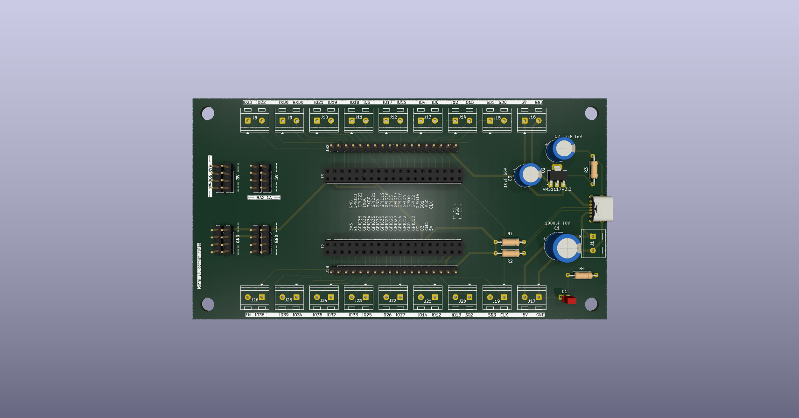

# ESP32 Shield V1


---

## About the Project

A **student electronics project** — a large, spacious development shield designed to make working with ESP32 reliable, practical, and accessible. Whether you're prototyping, learning, or building something more permanent, this board gives you the room and connectivity to do it right.

The ESP32 Shield V1 breaks out **all useful GPIO pins** (bootstrapping pins like GPIO11 excluded) through both **terminal block connectors** for permanent wiring and **male pin headers** for Dupont jumper wire access. It supports both the **ESP32 DevKit C** and **ESP32-S** variants — both fit into the onboard 2×19 socket pins.

Power is supplied through a modern **USB-C 6-pin connector**, compatible with any USB-C charger or USB-A to USB-C adapter — no more bulky legacy connectors. A **power LED** confirms the board is live at a glance.

---

## Features

-  **USB-C Power Input** — 6-pin USB-C connector; works with any USB-C or USB-A (female-to-USB-C) charger
-  **Full GPIO Breakout** — all useful ESP32 GPIO pins exposed (bootstrapping pins excluded)
-  **Terminal Block Connectors** — for all useful pins, ideal for permanent or semi-permanent wiring
-  **Male Pin Headers** — Dupont-compatible, for quick breadboard or jumper wire access
-  **ESP32 DevKit C & 32S Compatible** — both modules fit the 2×19 socket pin layout
-  **5V Rail up to 1A** — 2 terminal blocks with 5V and GND in 1:1 configuration
-  **5V & 3.3V Header Pins** — 2×4 header for 5V and 3.3V (max 500mA via AMS1117-3.3 regulator)
-  **4×4 GND Header** — dedicated ground header block
-  **Power Indicator LED** — shows board is powered and ready
-  **Big, Spacious Board** — generous layout for comfortable hand soldering and clear wiring

---

## Gallery

<p align="center">
  
  &nbsp;&nbsp;
  
</p>

---

## Documents

| Document | Link |
|---|---|
| PCB Layout | [shield_v1_pcb.pdf](esp32_development_shield_v1/auxiliar/screenshots/shield_v1_pcb.pdf) |
| Schematic | [shield_v1_schematic.pdf](esp32_development_shield_v1/auxiliar/screenshots/shield_v1_schematic.pdf) |

---

## Demo

<p align="center">
  
  <!-- If using mp4: see auxiliar/test_video/video.mp4 -->
</p>

---

## Folder Structure

```
esp32-shield-v1/
│
├── auxiliar/
│   ├── compatibility_info/       # Compatibility notes for ESP32 variants
│   ├── screenshots/              # Board photos (photo1–photo4)
│   └── test_video/               # Demo video (video.gif / video.mp4)
│
├── pcb/
│   ├── bom_files/                # 📋 Bill of Materials (BOM)
│   ├── drill_files/              # 🔩 Drill files for PCB fabrication
│   └── gerber_files/             # 📦 Gerber files — send these to your PCB fab
│
└── schematic/
    ├── esp32_node_devkit_shield_v1/   # Main schematic project files
    └── symbols&footprints/            # Custom KiCad symbols and footprints
```

> **PCB fabrication files are located in `/pcb/`:**
> - **`/pcb/gerber_files/`** — Production-ready Gerber files for your PCB manufacturer
> - **`/pcb/drill_files/`** — Drill/Excellon files for hole placement
> - **`/pcb/bom_files/`** — Bill of Materials for component sourcing

---

## Getting Started

1. Clone or download this repository
2. Open the schematic in **KiCad** from `/schematic/esp32_node_devkit_shield_v1/`
3. Review the BOM in `/pcb/bom_files/` and source your components
4. Send the files from `/pcb/gerber_files/` and `/pcb/drill_files/` to your preferred PCB manufacturer
5. Assemble, plug in your ESP32 DevKit C or 32S, connect USB-C power, and build something!

---

## Compatibility

| Module | Fits? |
|---|---|
| ESP32 DevKit C | ✅ Yes |
| ESP32-S (DevKitS) | ✅ Yes |

See `/auxiliar/compatibility_info/` for detailed notes.

---

## Power Specifications

| Rail | Max Current | Connector Type |
|---|---|---|
| 5V | 1A | 2× Terminal Block (5V + GND) |
| 5V | — | 2×4 Pin Header |
| 3.3V | 500mA | 2×4 Pin Header (AMS1117-3.3) |
| GND | — | 4×4 Pin Header |

---

## License

This project is open source. Feel free to use, modify, and build upon it for personal and educational purposes.

---

*Made with monster-energy and a soldering iron — student electronics project*
